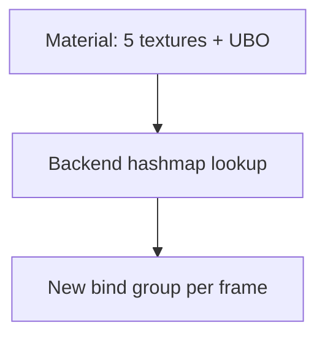
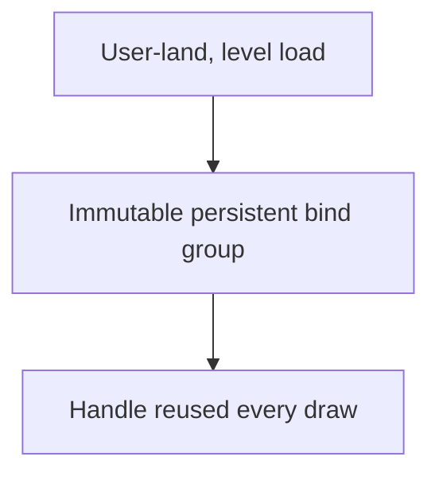

Extract research material into `/mnt/archive4/PAPERS/Prepared/` as annotated markdown with images, transcripts, and OCR. The orchestrator (you) is a thin coordinator: every load-bearing pass runs in a dedicated sub-agent's context window so the parent session stays small.

## Toolchain layout

The Python pipeline ships with the skill, including its own venv. Everything is self-contained at `~/.claude/skills/research/`:

```
~/.claude/skills/research/
├── SKILL.md              ← this file
├── pyproject.toml        ← uv-managed Python dep spec
├── package.json          ← npm-managed Node dep spec (Pass 2.5 validators)
├── .venv/                ← skill-local Python venv (created by `uv sync`, gitignored)
├── node_modules/         ← skill-local Node modules (created by `npm install`, gitignored)
└── tools/
    ├── README.md
    ├── extract_research.py
    ├── extract_research_phase2.py
    ├── cleanup_research.py
    ├── research_video.py
    ├── transcribe_to_srt.py
    ├── upgrade_to_slide_renders.py
    ├── redetect_scenes.py
    ├── subsample_long_scenes.py
    ├── srt_to_windows.py
    ├── validate_research.py    ← Pass 2.5: extract LaTeX/Mermaid blocks → Node validator
    ├── validate_md.mjs         ← Pass 2.5: KaTeX + mermaid.parse() syntax checker
    └── render_md_html.mjs      ← Pass 2.5: optional self-contained HTML preview
```

**Why a skill-local venv** (not the project's `tools/.venv/`): projects vary wildly in their Python requirements — some have no venv at all, some have one with conflicting versions (numpy pinned for ML, opencv with GUI flavour, …). The research pipeline needs specific versions of PyMuPDF, opencv-python-headless, faster-whisper, etc. Pinning those at the skill level decouples the toolchain from whatever the project happens to have lying around.

**uv as the package manager.** Dependencies are pinned in `pyproject.toml`; the venv is created/updated with `uv sync` from the skill directory. uv resolves and installs in seconds vs minutes for plain pip — important when the skill is dispatched from many projects.

### Setup (first run only)

```bash
cd ~/.claude/skills/research
uv sync                       # Python: creates .venv, installs deps (~30 s cold)
npm install --no-audit --no-fund   # Node: installs Pass 2.5 validators (~10 s cold)
```

The Node install pulls KaTeX (LaTeX validator + renderer), mermaid + jsdom (Mermaid parser), markdown-it + @vscode/markdown-it-katex (HTML preview). Required by `tools/validate_research.py` (Pass 2.5). Total disk footprint ~30 MB. Skip only if you intend to never run Pass 2.5 — the rest of the pipeline does not depend on it.

Plus system dependencies (tracked in `tools/README.md`):

```bash
# Arch
sudo pacman -S libreoffice-fresh yt-dlp ffmpeg

# Debian / Ubuntu
sudo apt install libreoffice yt-dlp ffmpeg

# macOS
brew install --cask libreoffice
brew install yt-dlp ffmpeg
```

LibreOffice is needed for PPTX → PNG rendering. yt-dlp + ffmpeg are needed for the video pipeline. OCR is provided by [OpenOCR](https://github.com/Topdu/OpenOCR) (`openocr-python`), pinned in `pyproject.toml` — no system OCR engine is needed. OpenOCR auto-downloads ONNX detection + recognition models (~36 MB total) to `~/.cache/openocr/` on first use.

### API key for the marker LLM tier — source `~/.envrc` before every extraction (binding)

The marker prepass on a text-paper PDF (Pass 1's equation / table / heading cleanup, plus `redo_inline_math`) is an LLM-backed tier that needs `CLAUDE_API_KEY` in the environment. The canonical home for that key on this setup is **`~/.envrc`**. The Claude Code session shell does NOT export it automatically, so **every `extract_research.py` invocation on a paper PDF must run under a shell that has sourced it** — prepend `source ~/.envrc` to the command:

```bash
bash -c 'set -a; source ~/.envrc; set +a; ~/.claude/skills/research/.venv/bin/python ~/.claude/skills/research/tools/extract_research.py "<source-path>" --slug=<slug>'
```

The extractor agent's brief MUST carry this — the agent does not know where the key lives otherwise, and the failure is silent-by-degradation, not a hard stop.

**The 401 symptom and why it is a hard failure, not a warning.** When the key is absent, expired, or wrong, marker's GPU passes (surya layout + OCR) still succeed, but every LLM-cleanup processor (`LLMTableProcessor`, `LLMMathBlockProcessor`, `LLMSectionHeaderProcessor`, `redo_inline_math`) fails with HTTP 401 and is skipped. The run does NOT fall through to PyMuPDF — it produces *marker-without-LLM* output: text layer present, but no equation reconstruction, no table merge, no heading repair, no inline-math redo. For a math-bearing paper that is a quality regression that reads like success. Treat a 401 report from the extractor as a blocking error: fix the key (source `~/.envrc`) and re-run with `--force`, do not proceed to Pass 2 on degraded output.

**The 400 "credit balance too low" mode — key valid, billing exhausted.** A correctly-sourced key can still fail if the API account is out of credit: surya OCR/layout runs fine, but the three LLM cleanup processors each return HTTP 400 and make zero LLM calls. There is no `marker FAILED` line — the only signature is `llm_request_count: 0` / `llm_token_count: 0` in `assets/<slug>/marker-meta.json` (plus 400s in the run log). Born-digital PDFs keep their body text but lose heading levels, tables, and inline-math repair. Note the auth split: the Claude Code session and its vision/refine sub-agents use separate auth and keep working — only marker's direct `CLAUDE_API_KEY` calls hit the exhausted account, so the Opus refiner can salvage the structural repair (headings, equations, axis values) if a funded key is unavailable. To redo cleanly once funded: `rm assets/<slug>/marker-meta.json` then `extract_research.py --only=<slug> --force`.

**Do not scavenge keys from random project `.env` files.** A stale `ANTHROPIC_API_KEY` in some unrelated project (`chat/.env`, etc.) is the trap — it is often expired and is exactly what produces the silent 401. `~/.envrc`'s `CLAUDE_API_KEY` is the single source of truth; ignore everything else.

### Invocation

The agents invoke scripts using the skill venv directly. The two extraction scripts take the **source path** as their first argument; the canonical slug is passed with `--slug`:

```bash
~/.claude/skills/research/.venv/bin/python ~/.claude/skills/research/tools/extract_research.py <source-path> --slug=<slug>
```

The per-slug post-processing scripts (`cleanup_research.py`, `validate_research.py`, `update_topics.py`) operate on the already-written `/mnt/archive4/PAPERS/Prepared/<slug>.md` and take `--only=<slug>` instead (`update_topics.py` reads the document's final `tags` and regenerates the `topics/` index pages that link it):

```bash
~/.claude/skills/research/.venv/bin/python ~/.claude/skills/research/tools/validate_research.py --only=<slug>
```

Either can also run via `uv run` (which auto-syncs if `pyproject.toml` changed); the explicit-path form is faster because it skips the uv sync check:

```bash
uv run --project ~/.claude/skills/research python ~/.claude/skills/research/tools/extract_research.py <source-path> --slug=<slug>
```

### Per-document helpers

One-off helpers (e.g. `split_<slug>_notes.py` for a particular deck's PowerPoint Notes-Pages text-layer split) stay in `<project>/tools/`, never in the skill — they are project-specific and would clutter the shared skill.

### Legacy project copies

Projects that adopted /research before this restructuring (notably `woweyreey`) may have their own `<project>/tools/*.py` copies running against `<project>/tools/.venv/`. Those continue to work but are **legacy**: no further updates land there. Migration path for those projects: `cd ~/.claude/skills/research && uv sync`, then update any project-specific `tools/<script>.py` invocations to point at the skill copy.

## Output frontmatter schema

Every extracted document emits an OKF-adapted YAML frontmatter block. The canonical field definitions and controlled vocabularies (`type`, `medium`, `tags`) are in `~/.claude/skills/research/OKF-SCHEMA.md`. The extraction scripts (`extract_research.py`, `research_video.py`) emit `type`, `title`, `medium`, `source`, format-specific keys (`pages`, `slide_deck`, `duration`), `extracted`, and `slug`. The refiner (Pass 3) fills `description` and `tags`, and corrects `type` when the script heuristic guessed wrong.

## Architecture overview

You are the orchestrator for the /research skill. You do **not** read 268-slide PDFs or run the OCR pipeline yourself. Instead, you scope the work and dispatch it to specialised sub-agents:

| Pass | Agent | Purpose |
|---|---|---|
| 1 — extract & mark | `research-extractor` | Run `extract_research.py <source-path> --slug=<slug>` (and `extract_research_phase2.py` for PPTX), archive source to `/mnt/archive4/PAPERS/`. **Then read the produced markdown and mark every problematic area inline with a `<!-- FIXME(extract): … -->` comment** — garbled equations, suspect OCR, and (critically) each page that needs a vision-pass description. Report the slug, asset counts, and the count of pages flagged for vision. |
| 2 — vision _(conditional)_ | `research-vision` | Read slide / figure images and **reconstruct each slide's structure in markdown** (verbatim nested bullets, tables, ```mermaid diagrams, two-column subfigures, code, LaTeX — see "Structural reconstruction policy"), load-bearing, with a `<!-- vision: reconstructed … -->` provenance marker above and the frame embedded below. **Dispatched ONLY when more than 5 pages need a vision pass** (per the extractor's `FIXME(extract): … needs vision` marks). When 5 or fewer pages need vision, skip this pass entirely — Pass 3 folds the handful in. Batches well — dispatch one agent per ~30 slides to keep individual context lean (reconstruction is heavier than captioning, so lean toward ~25). |
| 2.5 — validate | _(orchestrator runs inline)_ | Run `tools/validate_research.py --only=<slug>`: every LaTeX block (`$…$`, `$$…$$`) is parsed by KaTeX and every Mermaid fenced block by `mermaid.parse()`. Errors are written to `findings-pass2.5-validate.md` for the refiner to fix, and to stderr for the orchestrator. Optional `--html` produces a browser-openable preview. |
| 3 — refine _(+ inline vision)_ | `research-refiner` | Heading fixes, broken-Unicode equation re-transcription, speaker-notes typo cleanup, optional top-of-doc summary. **Resolves every `FIXME(extract)` and `FIXME(vision)` mark left in the document and deletes the comment once handled.** When Pass 2 was skipped (≤5 vision pages), the refiner also **reconstructs those pages itself** per the Structural reconstruction policy (verbatim bullets/tables/mermaid/subfigures, not a summary). Brief MUST cite the Pass-2.5 sidecar so the refiner has a concrete error list to address. |
| 3.5 — re-validate | _(orchestrator runs inline, optional)_ | Re-run `tools/validate_research.py --only=<slug>` as a clean-room check after refine. If anything regressed (new errors introduced, old errors not fixed), re-dispatch the refiner. |

You may also dispatch additional vision-pass batches **between** Pass 2 and 3 (e.g. "vision-pass slides 100-130 of the same doc, focusing on plot panels") if the first pass missed coverage. Multiple batches against the **same** paper must run sequentially — they all Edit the same `<slug>.md` and concurrent edits collide.

**Sub-agent model pins — the orchestrator MUST pass `model` explicitly on every Agent dispatch.**

The `model:` field in each agent's frontmatter is **advisory only and is NOT reliably applied** — in practice a dispatched sub-agent inherits the parent session's model (typically Opus) unless the orchestrator passes the `model` parameter explicitly on the Agent tool call. Relying on the frontmatter silently runs the cheap mechanical passes (extract / vision) on Opus, which is a large, avoidable cost. **Every `/research` dispatch must set `model` explicitly:**

| Agent | **Pass `model:` =** | Rationale |
|---|---|---|
| `research-extractor` | **`"sonnet"`** | Pass 1 is mostly script orchestration (run the extraction scripts on the source path, archive) — Sonnet handles it cheaply. |
| `research-vision` | **`"sonnet"`** | Cost-dominant workload — hundreds of images per deck in ~30-image batches. Sonnet 4.6 vision quality is strong at meaningfully lower per-token cost than Opus. |
| `research-refiner` | **`"opus"`** | **Quality-control gate, and — when Pass 2 is skipped — the inline vision pass.** Refiner is where math correctness is verified, OCR-corrupted equations are reconstructed, and scientifically-load-bearing formulas (HG, Rayleigh, Mie, transport equations) get their final form before the document becomes citable. A wrong-but-plausible LaTeX equation that ships through is harder to detect than a missing one — for example, marker once produced `(1 + cos a)` for the Rayleigh phase function where the canonical form is `(1 + cos²a)`; a Sonnet refiner missed the dropped exponent because the broken form is syntactically valid LaTeX, but the surrounding paragraph ("forward = backward scatter") only makes sense for the squared form. Opus's stronger cross-source reasoning catches that class of error. The refiner is the ONLY pass that runs on Opus — and it must be the 1M-context Opus build (`claude-opus-4-7[1m]`); the Agent tool's `model` enum is coarse, so pass `model: "opus"` and state the 1M-context requirement in the brief. |

Concretely: extractor / vision dispatches pass `model: "sonnet"`; refiner dispatches pass `model: "opus"`. The orchestrator itself inherits whatever model the parent session runs on — that is fine and unavoidable; only the dispatched sub-agents need the explicit override. If you find yourself dispatching a `/research` sub-agent without a `model` argument, that is a bug — add it.

**Math-heavy papers — recommend a manual orchestrator vision-pass audit after the refiner**: when the source paper carries scientifically load-bearing equations (radiative-transfer integrals, BRDF formulas, phase functions, error metrics, transport equations) AND the source is photoscanned with Acrobat OCR, the orchestrator (running on the parent-session model, typically Opus 4.x) should do a quick equation-by-equation cross-reference against the page renders before finishing the run. The refiner agent does this against text-layer artefacts, but a second pass by the orchestrator with direct visual access to the page renders is the right belt-and-braces approach for canonical primary sources. Note the audit in your final summary to the user.

### Inline `FIXME` marks — cross-pass communication channel

Passes do not write separate findings-sidecar files. Instead, each pass that spots a problem it is not the right pass to fix **marks it inline in `<slug>.md`** with a greppable HTML comment placed at the problem site:

- **Pass 1 (extractor)** — `<!-- FIXME(extract): … -->`. Garbled / suspect equations, OCR artefacts, and every page that needs a vision-pass description (`<!-- FIXME(extract): pNNN needs vision — <one line on what's on the page> -->`).
- **Pass 2 (vision)** — `<!-- FIXME(vision): … -->`. Uncertainty flags (a label / number it could not read cleanly) and body-text-vs-render divergences it spotted but does not have authority to fix.
- **Pass 3 (refiner)** — resolves every `FIXME(extract)` and `FIXME(vision)` mark and **deletes the comment once handled**. Anything the refiner cannot resolve from text-layer + render evidence alone it re-marks `<!-- FIXME(audit): … -->` and surfaces in its return message for an orchestrator audit.

**Why inline instead of sidecar files:** the mark lives exactly where the problem is, so the fixing pass sees it in context while reading the document it is already reading end-to-end — no second file to open, no template ceremony, no findings content passing through the orchestrator's context. The orchestrator counts marks with a single `grep -c`, never by reading them.

**Orchestrator dispatch briefs must** tell each agent (a) to leave its `FIXME(<pass>)` marks inline at the problem site, and (b) — for the refiner — to grep for `FIXME(extract)` and `FIXME(vision)`, resolve each, and delete the comment. A refiner that finishes with `FIXME(extract)` / `FIXME(vision)` comments still in the document has not completed its pass. The marks are plain text inside the file every pass already edits, so there is no separate-file write that can fail — but if a sub-agent reports it cannot Edit `<slug>.md` at all (permission denied, harness block), the orchestrator's correct response is to **re-dispatch**, never to make the edits itself from the agent's return text. (If sub-agent edits are failing systemically, the root cause is usually a missing `Write`/`Edit` permission-allow rule for the `/mnt/archive4/PAPERS/Prepared/**` path — add it to the user's global `~/.claude/settings.json` and fix that, don't work around it.)

### Concurrency rules (read this before dispatching anything in parallel)

The /research pipeline mixes **GPU-bound local inference** (marker / surya) with **API-only LLM dispatch** (Sonnet vision / Gemini structural cleanup), and the per-paper `.md` files are written-through by every pass. The right concurrency strategy depends on which pass and whether you're processing one paper or a batch.

**Hard sequential — never run two of these at once on the same machine:**

- **Pass 1 (extraction) across any number of papers**. Marker's surya layout + text-recognition models need ~1.5–2 GiB contiguous VRAM and saturate the GPU during inference. Two parallel extractions guarantee CUDA OOM (one or both fall through to the PyMuPDF span-walker, silently degrading body-text quality). The legacy PyMuPDF-only path was parallel-safe, but post-marker that no longer holds — and an OOM-driven fall-through reads as "marker worked, but produced poor output" rather than a clear failure.
- **Pass 1 → Pass 2 → Pass 3 within the same paper**. Each pass writes the same `<slug>.md`; the next pass reads what the previous wrote. Pipelined, not parallel.
- **Multiple vision-pass batches against the same paper**. Same `<slug>.md` again.

**Parallel-safe — only when each agent owns a different `<slug>.md`:**

- **Pass 2 (vision) across different papers**. Each agent edits its own per-paper markdown; vision calls go to the Sonnet API, not the local GPU. Several can run concurrently without contention.
- **Pass 3 (refine) across different papers**. Same reasoning.

**Recommended dispatch flow for a single paper** (the typical /research invocation):

> Pass 1 → Pass 2 (only if >5 pages need vision; one or more sequential batches if the deck is large) → Pass 3. Fully sequential. This is what the three-agent dance assumes by default.

**Recommended dispatch flow for a batch of N papers** (when the user passes a list of sources):

> 1. **Phase A — sequential extract.** Run Pass 1 once per paper, **one at a time** (GPU is shared). Wait for each extractor to finish before dispatching the next. Per-paper marker output is cached at `assets/<slug>/marker.md` so this phase is the GPU-bound bottleneck and worth getting right on the first try (avoid `--force` retries unless you observe a marker failure in the agent's report).
> 2. **Phase B — parallel vision.** Once Phase A is done, dispatch a `research-vision` agent for each paper whose vision-flag count is >5 — in parallel, one per paper. Each owns its own `<slug>.md` so there's no edit collision; vision is API-bound (Sonnet) so there's no local-GPU contention. Papers with ≤5 vision flags skip this phase (folded into Phase C).
> 3. **Phase C — parallel refine.** Same pattern: N `research-refiner` agents, one per paper, dispatched in parallel. For papers that skipped Phase B, the refiner brief carries the inline-vision page list.

The phased flow turns what would be N × (Pass 1 + Pass 2 + Pass 3) sequential dispatches into approximately (N × Pass 1) + max(Pass 2) + max(Pass 3) wall time, which on a typical 5-paper batch is roughly 2× faster.

**Pre-marker history**: the old skill text said research extraction was exempt from the project's "no parallel sub-agents" rule because PyMuPDF + OpenOCR were CPU-bound and embarrassingly parallel. That exemption no longer applies — the marker prepass moved Pass 1 onto the GPU and Pass 1 is now hard-serialised across papers. Pass 2 and Pass 3 remain parallel-safe across different papers because they don't touch the local GPU.

### Running inside a /delegate orchestrator

If your top-level invocation came from `/delegate` (the multi-agent orchestration mode that uses shared `docs/orchestrate/<topic>/` files), you are **doubly orchestrating**: /delegate dispatched you to handle the research portion, and you in turn dispatch the three research sub-agents. In that mode:

- The parent `/delegate` orchestrator owns `docs/orchestrate/<topic>/` and expects status reports there. Pass that directory path through to each sub-agent's brief so they append their findings to `docs/orchestrate/<topic>/<NN>-research-<pass>.md`.
- Do not re-do reuse-audit / architectural Q&A — `/delegate` already covered those. Treat your role as "the one that knows /research" within the larger plan.
- Your final message to the parent /delegate orchestrator is a one-screen summary; the file deliverables on disk are the load-bearing output.

If you are invoked directly (not via /delegate), skip the `docs/orchestrate/<topic>/` dance — the briefs talk to the three research agents directly, and your final message to the user summarises the work.

### When to skip dispatch

For a small extraction (single-page paper, < 5 slides, or "just rerun extraction on an existing source"), running the three-agent dance is wasteful. In that case:

- Pass 1 you can run inline (it's a script invocation).
- **Pass 3 (refine) still gets dispatched**: it is the context-heavy quality gate and the agent boundary is what makes the skill scale.
- Pass 2 (vision) follows the >5-page rule like always — for a sub-5-page source it is folded into Pass 3 by definition.

## Structural reconstruction policy (vision pass output — LOAD-BEARING)

**The vision pass is load-bearing, not a caption.** It does NOT summarise a slide/figure into one prose block beside the image. It **reconstructs the source's structure faithfully in markdown** — using every applicable markdown tool — so the `.md` carries the same information and organisation as the source, and is greppable/indexable for agentic use. The reconstruction **is** the slide section's body; the frame render sits beneath it as the ground truth to verify against. We convert PDFs/decks/talks to markdown precisely so agents can read and act on the content directly — a prose summary throws that away.

Reconstruct with the richest markdown that fits the content — use all of these where applicable, not just prose:

| Source content | Reconstruct as |
|---|---|
| Bullet / numbered hierarchy | **nested markdown lists, text VERBATIM** — preserve wording, order, and depth; carry emphasis (`**bold**` for bolded/colour-highlighted terms — colour often encodes meaning, e.g. a red "SLOW!") |
| Data table, legend, comparison grid, key/value panel | **markdown table** |
| Flowchart, pipeline, architecture, box-and-arrow, tree, state machine, timeline, dependency graph | **```mermaid** diagram (`flowchart`/`graph`/`sequenceDiagram`/`stateDiagram`/`gantt` as fits) |
| Multi-panel figure, before/after, side-by-side variants | **two-column subfigure layout** (fenced-div, below) with per-panel captions |
| Code shown as an image | **fenced code block** with a language tag, transcribed verbatim |
| Equation / formula | **LaTeX** — `$…$` inline, `$$…$$` display |
| Quantitative plot / chart | axes + conventions, then transcribe the readable data points into a **small table** (or a `mermaid xychart` when simple); mark any value read approximately |
| Photograph, screenshot, in-engine render, artwork | **prose description** — these genuinely cannot be reconstructed; say what rendering feature / result it demonstrates |

A single slide usually needs **several** of these together (the bind-groups slide = a 3-level bullet list on the left + a slot-legend table on the right). Reconstruct each region with its right tool and lay them out in the order they appear.

### Two-column subfigures inside `.md`

Use the fenced-div layout (Quarto/pandoc renders the columns; agents read the structure directly; GitHub renders each mermaid panel). Keep the fence as ```` ```mermaid ```` (NOT ```` ```{mermaid} ````) so the Pass-2.5 validator parses it and GitHub renders it:

````
::: {layout-ncol=2}

::: {#fig-trad}

Traditional: on-demand, hashmap-cached (slow)
:::

::: {#fig-hh}

HypeHype: user-land persistent
:::

Bind-group construction — on-demand vs. persistent.
:::
````

### Provenance & auditability (non-negotiable)

Reconstructed content is the lossy stage — it can carry vision errors — so it must stay auditable:

- Immediately **above** each reconstructed region, place a greppable provenance marker: `<!-- vision: reconstructed from frame-XXXX.jpg — verify against image -->`.
- Embed the frame render **directly below** the reconstruction — it is the ground truth a reader/refiner checks the bullets, tables, and diagrams against.
- Genuine image descriptions (photos/renders) keep the explicit prose tag `**Image (LLM vision pass):**` — there is nothing to reconstruct, so the prose IS the vision output and must be marked as such.
- Mark any value/label read with low confidence inline (`≈`, "approx.") or with `<!-- FIXME(vision): … -->`; never fabricate precision.
- `research-refiner` may fix an obviously-wrong reconstruction against the frame, but flags anything it cannot verify with `<!-- FIXME(audit): … -->` rather than guessing.

### Per-slide section shape

```
## Slide N — <title verbatim>
*[timestamp] (Ns)*

<!-- vision: reconstructed from frame-0067-4137.jpg — verify against image -->

<verbatim nested bullets / tables / mermaid / subfigures / code — the load-bearing body>


> <transcript / speaker narration for this slide>
```

### Fidelity discipline

- **Verbatim first, gloss second.** Transcribe the slide's own words and structure exactly; do not paraphrase or compress. Add a one-line interpretive gloss only where meaning isn't self-evident from the slide's text.
- **Preserve order and hierarchy** — a reader must be able to reconstruct the slide's layout from the markdown alone.
- **Do not merge or drop bullets.** Every load-bearing line on the slide appears in the reconstruction.

### Skip rules

A slide gets **no reconstruction** ONLY when it is:

- **Decorative**: title page, agenda, section divider, "Thanks!", "References", transition card, pure chrome.
- **Already reconstructed**: a reconstruction for that frame already exists — re-doing it would duplicate.

Note the change from the old policy: a **pure-text bullet slide is NOT skipped** any more. Under the load-bearing model its bullets are reconstructed verbatim (they used to be skipped because the raw OCR dump duplicated them — that dump is now removed, so the frame is the only source of that structure and the vision pass owns it). Skip only genuinely contentless slides.

## REQUIRED: Citable Canonical Naming

Every extracted document MUST be filed under a **citable canonical slug**. Decide the slug **before** running Pass 1 and pass it as `extract_research.py <source-path> --slug=<canonical>`; the script writes `<canonical>.md` directly, so there is normally no rename step. A title-derived slug like `intro-to-gpu-occlusion` is **scaffolding only** — it appears solely in the fallback where a script ran without `--slug` (it then slugifies the filename stem), and that file MUST be renamed to the canonical slug before the run finishes.

**Pattern:** `<author-surname(-coauthor)?>-<year>-<short-topic>.md`

- Author surname(s) lowercased, hyphen-separated. For 1 author: `brands`. For 2: `aaltonen-haar`. For 3+: first author only or first-last (match adjacent corpus precedent).
- Year is the publication / talk year (4 digits).
- Short topic: 1–4 hyphenated words capturing the load-bearing technical contribution, not the marketing title. Strip "intro to", "advances in", "real-time", "an efficient", etc. — they appear in every paper and add zero discriminating power.
- All lowercase, hyphen-separated, no underscores, no caps, no punctuation.

**Examples** (from the existing corpus):

| Source title | Canonical slug |
|---|---|
| "Intro to GPU Occlusion" (Leon Brands, GPC 2024) | `brands-2024-gpu-occlusion` |
| "GPU-Driven Rendering Pipelines" (Haar & Aaltonen, SIGGRAPH 2015) | `aaltonen-haar-2015-gpu-driven` |
| "Improved Culling for Tiled and Clustered Rendering" (Drobot, SIGGRAPH 2017) | `drobot-2017-improved-culling` |
| "Real-Time, All-Frequency Shadows in Dynamic Scenes" (Annen et al., TOG 2008) | `annen-2008-all-frequency-shadows` |
| "Adaptive Shadow Maps" (Fernando et al., SIGGRAPH 2001) | `fernando-2001-adaptive-shadow-maps` |
| "Sparse Virtual Textures" (Sean Barrett, GDC 2008) | `barrett-2008-sparse-virtual-textures` |
| "Creating the Atmospheric World of Red Dead Redemption 2" (Bauer, SIGGRAPH 2019) | `bauer-2019-rdr2-atmospherics` |

**Why this matters:** the corpus is cross-referenced from `docs/`, memory files, and other research notes by slug. Title-derived slugs (`intro-to-gpu-occlusion`, `volumetric-fog-in-enshrouded`) are not citation-stable — two unrelated talks could share a generic title — and they break the corpus convention. Anything filed under a non-canonical slug must be renamed before commit; deferring this creates dangling references.

**Required actions:**

1. Pick the canonical slug per the rules above (cross-check the existing `*.md` files in `/mnt/archive4/PAPERS/Prepared/` for adjacent precedent if unsure — match the surrounding pattern) and pass it as `--slug=<canonical>` to Pass 1. This is the normal path — `<canonical>.md` and `assets/<canonical>/` are written directly.
2. **Only if a scaffolding slug slipped through** (a script ran without `--slug`), rename before the run finishes:
   - `mv /mnt/archive4/PAPERS/Prepared/<scaffolding>.md /mnt/archive4/PAPERS/Prepared/<canonical>.md`
   - `mv /mnt/archive4/PAPERS/Prepared/assets/<scaffolding>/ /mnt/archive4/PAPERS/Prepared/assets/<canonical>/`
   - Update inside the markdown: `slug:` frontmatter field, every `assets/<scaffolding>/` image path.

If the source genuinely has no clear single author (e.g. an Epic UE documentation page, a vendor whitepaper), use the publishing organisation in lowercase as the "author": `epic-2022-ue51-virtual-shadow-maps-docs`, `khronos-2023-...`. Match adjacent corpus precedent.

## REQUIRED: Source Archive in `/mnt/archive4/PAPERS/`

Every research source — PDF, PPTX, YouTube video, HLS / m3u8 stream, local mp4 — **MUST** be preserved at its canonical name in `/mnt/archive4/PAPERS/`. This is the long-term archive of every primary document the project depends on. The markdown extracts in `/mnt/archive4/PAPERS/Prepared/*.md` are derived artefacts; **PAPERS/ is the source of truth**.

**Layout:**

| Source type | Where it lives in PAPERS/ |
|---|---|
| PDF | `/mnt/archive4/PAPERS/<canonical-slug>.pdf` |
| PPTX | `/mnt/archive4/PAPERS/<canonical-slug>.pptx` |
| YouTube video | `/mnt/archive4/PAPERS/<year>-<slug-tail>/<canonical-slug>.mp4` + `<canonical-slug>.en.srt` |
| HLS / m3u8 stream | same folder layout as YouTube |
| Local mp4/mkv/webm + SRT | same folder layout as YouTube |

The canonical slug is the same one used for `/mnt/archive4/PAPERS/Prepared/<slug>.md` (see "REQUIRED: Citable Canonical Naming" above). The video-folder prefix `<year>-<slug-tail>` is just the canonical slug rotated so the year sorts first — e.g. canonical `feller-2024-volumetric-fog-enshrouded` → folder `2024-feller-volumetric-fog-enshrouded/`.

**Examples:**

```
/mnt/archive4/PAPERS/
├── annen-2008-all-frequency-shadows.pdf
├── hillaire-2020-sky-atmosphere.pdf
├── bauer-2019-rdr2-atmospherics.pptx
├── wright-2021-radiance-caching-lumen.pptx
├── 2024-feller-volumetric-fog-enshrouded/
│   ├── feller-2024-volumetric-fog-enshrouded.mp4
│   └── feller-2024-volumetric-fog-enshrouded.en.srt
└── 2024-dekeersmaecker-numerical-precision-large-worlds/
    ├── dekeersmaecker-2024-numerical-precision-large-worlds.mp4
    └── dekeersmaecker-2024-numerical-precision-large-worlds.en.srt
```

**When to copy:** After Pass 1 (automated extraction) finishes and the canonical slug is decided, copy the source(s) into PAPERS/ **before you finish the run**. Copy must use the canonical slug, never the scaffolding slug emitted by Pass 1.

For PDFs / PPTXs:
```bash
cp "<source-path>" "/mnt/archive4/PAPERS/<slug>.<ext>"
```

For YouTube / HLS / local videos (yt-dlp + research_video.py write into `/tmp/research-<random>/<scaffolding>.{mp4,en.srt}`):
```bash
mkdir -p "/mnt/archive4/PAPERS/<year>-<slug-tail>/"
cp "/tmp/research-XXXX/<scaffolding>.mp4"    "/mnt/archive4/PAPERS/<year>-<slug-tail>/<slug>.mp4"
cp "/tmp/research-XXXX/<scaffolding>.en.srt" "/mnt/archive4/PAPERS/<year>-<slug-tail>/<slug>.en.srt"
```

**Why this matters:**
- `tempfile.mkdtemp(prefix="research-")` does not auto-clean, but `/tmp` is wiped on reboot, and the videos are typically 100 MB+. Without the explicit copy, every `/research` rerun re-downloads from the network.
- A canonical-slugged file in PAPERS/ is the citation target for everything else (memory, design docs, sub-agents). Title-derived scaffolding names break those references.
- Pass 2 vision and Pass 3 refine can re-read the source from PAPERS/ on subsequent runs without re-extraction.

**Skip criteria:** none. Even small or "obvious" sources get archived — the point of the archive is that it's complete. The only exception is a source that is genuinely already at its canonical path in PAPERS/ (cp into the same path is a no-op, but check the size — if the existing copy is smaller / corrupt, replace it).

## Arguments

The argument is a URL or file path:

- YouTube URL → download video, detect slides, OCR, re-transcribe the audio with the SOTA STT pass (faster-whisper `large-v3`), output markdown. The pipeline never uses YouTube auto-captions — they are lower quality and mis-segment technical vocabulary, so `research_video.py` always re-transcribes via `transcribe_to_srt.transcribe()`.
- HLS stream (m3u8 URL) → download via ffmpeg, transcribe with faster-whisper, then video pipeline
- `.pdf` path → extract text via marker (paper-PDFs with text-layer) or PyMuPDF (slide-deck PDFs and scanned PDFs) + full-page rendering (every page for both slide decks and papers; paper-mode pure-prose pages render as `pNNN-text.png` and are out of vision-pass scope — see render-policy table below). Marker uses Anthropic Claude `claude-sonnet-4-6` for structural cleanup (headings, tables, equations) with `redo_inline_math` enabled; requires `CLAUDE_API_KEY` (or `ANTHROPIC_API_KEY`) in env. Cached per-document at `assets/<slug>/marker.md` so re-runs are free; cache invalidates on PDF mtime change OR provider/model change OR `redo_inline_math` flag flip.
- `.pptx` path → render every slide via LibreOffice → PDF → PNG, plus python-pptx text + speaker notes
- `.mp4`/`.mkv`/`.webm` local path → video pipeline with `--title` and `--slug` flags

## REQUIRED: Vision pass MUST run on full-page renders

**The vision pass NEVER runs on per-figure cutouts extracted from a PDF.** This rule supersedes the older "paper-mode extracts embedded images as figures" policy, which produced unusable input for the vision agent and is now removed.

**Why cutouts fail.** PDF figures — diagrams, flowcharts, plots, cone-tracing illustrations, octree pyramids, cache-architecture diagrams — are typically authored as PostScript/vector composites or as tiled raster mosaics. PyMuPDF's `page.get_images(full=True)` decomposes a *single authored figure* into 5-40 separate xref entries: chart chrome split from plot data, sub-panels (a, b, c, d) split apart, vector strokes split from filled regions, decorative banners separated from the photo they frame. When the vision agent receives these cutouts, it cannot recover the authored figure — each cutout is a meaningless fragment. The agent then leans entirely on text-layer prose anchoring to write the description, which means the "vision pass" is in fact a *prose-paraphrase pass with image attribution*. That defeats the entire point of attaching `**Diagram (LLM vision pass):**` blocks for auditability.

**The unified rule.** Every PDF (paper or slide deck) and PPTX (always a slide deck) renders **full-page images** for the vision pass. The vision agent sees the page exactly as a reader would — caption, figure boundary, surrounding context, and full visual fidelity intact.

| Source class | What renders | Asset filename pattern | Naming rationale |
|---|---|---|---|
| **PPTX** (always slide deck) | every slide | `assets/<slug>/sNNN-slide.png` | one render per slide |
| **Slide-deck PDF** (PowerPoint / Keynote / Google Slides / Beamer / Impress export, or any landscape PDF with 4:3 / 16:10 / 16:9 aspect ratio across all pages) | every page | `assets/<slug>/sNNN-slide.png` | one render per slide |
| **Paper PDF** — figure-bearing page (per `_page_has_figure`) | rendered, **vision-pass scope** | `assets/<slug>/pNNN-page.png` | one render per figure-bearing page |
| **Paper PDF** — pure-prose page | rendered, **reference-only embed (vision skips)** | `assets/<slug>/pNNN-text.png` | one render per text-only page; embedded for visual reference (math equations, citation context, marker-fidelity spot-check) but the vision agent does not write a description block |

**Paper-mode rendering policy:** the extractor renders **every** paper-PDF page. The figure-bearing/text split is a **vision-pass scope** decision (encoded in the filename suffix), not a "render or skip" decision. The split is computed by `_page_has_figure(page)`, which returns True if **either**:

- It has any embedded raster image (`page.get_images(full=True)` non-empty), OR
- It has at least 12 vector drawing operations (`len(page.get_drawings()) >= 12`) — catches vector flowcharts, cone diagrams, cache-architecture schematics, octree pyramids.

A True result writes the page as `pNNN-page.png` and the vision agent processes it. A False result writes the page as `pNNN-text.png` and the markdown emitter prepends `<!-- vision-skip: text-only page (embedded for reference / math equation visual) -->` immediately above the image reference — the vision agent's hard-input contract treats both signals (filename suffix and HTML comment) as out-of-scope. The reference embed is what lets a human (or a future re-extraction audit) visually verify marker's text-layer extraction of math-bearing prose pages, which is otherwise unverifiable from the markdown alone — marker's LLM cleanup pass occasionally produces KaTeX-incompatible LaTeX (misplaced `&`, undefined macros), and Pass 2.5 catches the syntax error but the visual reference is what catches the *semantic* corruption (dropped exponent, swapped operator, etc.).

**Why we render text-only pages too** (vs the pre-2026-05 policy that skipped them entirely): math-bearing prose pages were unverifiable when the page render was missing — a refiner could only see marker's text-layer output, with no way to audit it against the source PDF page. Embedding the page render at `pNNN-text.png` is cheap (a few hundred KB per page) and turns "trust marker's LaTeX" into "spot-check marker's LaTeX against the rendered page". Cost: marginal disk; benefit: catches the class of corruption Pass 2.5 cannot (semantically-wrong-but-syntactically-valid LaTeX).

**Slide-deck classification** (`is_slide_deck_pdf`):

- PPTX → always `is_slide_deck = True`. Rendered via `soffice --headless --convert-to pdf`, then PyMuPDF rasterises each page.
- PDF → `is_slide_deck_pdf(doc)` triggers True if **any** of:
  - Metadata `creator` / `producer` / `title` / `subject` mentions PowerPoint / Keynote / Google Slides / Beamer / Impress / "presentation".
  - **All** pages are landscape AND aspect ratio is in `[1.25, 1.85]` (4:3 ≈ 1.33, 16:10 ≈ 1.6, 16:9 ≈ 1.78), AND page count ≥ 3.
- Override per-source: pass `--slide-deck` / `--no-slide-deck` to force a particular mode (absent ⇒ auto-detect).

**Paper-PDF body-text classification** (`_classify_paper_pdf`):

- For PDFs that are NOT slide-decks, sample first 10 pages and count those with ≥ 50 chars of text-layer content.
- Majority text-rich → `text-paper` → marker prepass via `marker_extract.convert_pdf` (real markdown structure, LaTeX equations, table reconstruction). Per-page markdown becomes `PageData.text`; `marker_extract.first_heading()` populates `PageData.heading` (replaces font-size > 14 heuristic).
- Otherwise → `scanned` → existing OpenOCR fallback path on PyMuPDF page renders. Marker is NOT used (its quality on scan-only PDFs without a usable text layer is poor; OpenOCR's CPU pipeline is the canonical fallback here).
- Override: `--no-marker` reverts text-paper PDFs to the legacy PyMuPDF span-walker. `--no-llm` runs marker locally (surya OCR + layout) without LLM API calls — viable when offline, but loses table-merge / equation / form / section-header repair.

**Marker prepass output** (text-paper route only):

- Input: paper-PDF path + per-source `assets/<slug>/` cache dir.
- Cache: `assets/<slug>/marker.md` (paginated markdown) + `assets/<slug>/marker-meta.json` (PDF mtime + use_llm + provider + model + redo_inline_math flag + LLM token totals). Cache invalidates on PDF mtime change OR use_llm flip OR provider/model change OR redo_inline_math flip; bypass with `--force`.
- Processor list = marker's defaults MINUS `LLMImageDescriptionProcessor` — that processor auto-describes every figure with the configured LLM, which would duplicate the /research vision pass with a less-strict prompt and inflate the LLM bill ~10×. Image FILES are also not extracted (we use PyMuPDF page renders for the vision pass).
- **LLM backend (default)**: Anthropic Claude `claude-sonnet-4-6` via `marker.services.claude.ClaudeService`, with `redo_inline_math: True`. API key resolved as: `CLAUDE_API_KEY` (canonical home `~/.envrc` — see "API key for the marker LLM tier" above; must be sourced into the invoking shell) → `ANTHROPIC_API_KEY` (Anthropic SDK fallback). `convert_pdf` raises a clear error if neither is set when `use_llm=True`, but a *present-but-invalid* key does NOT raise — it produces per-processor HTTP 401s and silent degradation to marker-without-LLM output (see the 401 symptom above). Override: pass `claude_model_name="claude-opus-4-7"` for the most math-dense primary sources where the cost premium is justified.
- **LLM backend (legacy)**: pass `llm_provider="gemini"` to fall back to `GoogleGeminiService` (model `gemini-2.0-flash`, key `GOOGLE_API_KEY`/`GEMINI_API_KEY`). **Not recommended** — Flash is the documented source of broken-LaTeX output the Pass 2.5 validator was built to catch (misplaced `&` inside `\begin{split}`, undefined macros like `\ddy`, dropped exponents on phase-function formulas). Use only for compatibility with older cached outputs that you don't want to re-extract.
- **Why Sonnet 4.6 over Opus 4.7**: marker invokes the LLM many times per document (one call per equation / table merge / complex region / page correction; with `redo_inline_math` also one per inline-math block). Cost-per-call dominates the bill on multi-page papers. Sonnet 4.6 matches Opus 4.7 on focused VQA + structured-JSON math/table cleanup at ~5× lower per-token cost; reserve Opus for thesis-scale math-dense sources where a wrong-formula citation would be especially expensive.
- **Why redo_inline_math is on by default**: inline math is exactly the surface where Flash failed (misplaced `&`, undefined macros), so the extra LLM call per inline-math block is a worthwhile baseline. Marker's own docs: *"If you want the absolute highest quality inline math conversion, use this along with `--use_llm`."*
- Cost envelope on a typical mid-length paper (Sonnet 4.6 + redo_inline_math): 5–30 LLM calls / 10–80 K tokens / a few cents. Re-runs are free thanks to the cache.
- **GPU memory pressure auto-handling**: `marker_extract._maybe_force_cpu_inference` runs before torch imports and sets `CUDA_VISIBLE_DEVICES=""` when free VRAM is below 2 GiB. Surya layout + recognition models need ~1.5 GiB contiguous; on dev workstations running Unity editor / Steam fossilize_replay / ML loads in parallel, free VRAM spikes unpredictably and a snapshot check a second before allocation is not enough. Forcing CPU when low is preferable to torch OOM-then-fall-through-to-PyMuPDF (which silently degrades quality). CPU inference is ~5–10× slower but acceptable for a typical 8-page paper (under a minute). Override: pre-set `CUDA_VISIBLE_DEVICES` (any value, including empty) to bypass the check.
- **Fall-through to PyMuPDF** still triggers if marker fails for any other reason (model download interrupted, paginated-output regex change upstream, etc.). The legacy span-walker output is structurally inferior but functionally usable for Pass 2 + Pass 3. When fall-through fires, `extract_research.py` prints `marker FAILED (...); falling back to PyMuPDF span-walker` — surface this in the extractor agent's report so the orchestrator can decide whether to re-run.

**Render scale**: slide decks render at 2.0× (a slide is already large with low information density per pixel), papers render at 2.5× (paper figures pack smaller-detail axis labels, sub-panel letters, equation glyphs that need extra resolution to be vision-readable).

**Removed**: the old `pNNN-figXX.png` cutout pattern. Existing extractions that used it must be re-run with `--force` against the updated `extract_research.py`. Any vision-pass blocks generated against cutouts are suspect — re-run the vision pass on the new full-page renders.

### PPTX rendering dependency: LibreOffice

PPTX → slide image rendering requires **LibreOffice headless** (`soffice` / `libreoffice` on PATH).

```bash
# Arch
sudo pacman -S libreoffice-fresh

# Debian / Ubuntu
sudo apt install libreoffice

# macOS
brew install --cask libreoffice
```

The script auto-detects `soffice` / `libreoffice` via `shutil.which` and falls back to common install paths (`/usr/bin/soffice`, `/Applications/LibreOffice.app/Contents/MacOS/soffice`). If LibreOffice is missing, `extract_research.py` raises a clear error pointing back to this section.

PPTX conversion takes ~30-60s per deck (LibreOffice cold-start + PDF export). Subsequent runs hit the same temp PDF if the script's `tempfile.mkdtemp` happens to land on an existing directory; in practice expect ~1 minute per deck on first run.

You may see `MuPDF error: format error: No common ancestor in structure tree` warnings during PPTX rendering — these are non-fatal, MuPDF complaining about LibreOffice's PDF tagging structure. The rendered images are still correct.

## Full Pipeline (3 passes — orchestrator dispatches each)

### Pass 1: Extract & mark (dispatched to research-extractor, or run inline for trivial sources)

For PDFs / PPTXs and recorded-talk videos, dispatch a `research-extractor` agent with a brief naming the source path / URL and the canonical slug. The agent runs `extract_research.py <source-path> --slug=<slug>` (plus `extract_research_phase2.py` for PPTX and `cleanup_research.py`), archives the source to `/mnt/archive4/PAPERS/`, then **reads the produced markdown end-to-end and marks every problematic area inline** with a `<!-- FIXME(extract): … -->` comment — garbled / suspect equations, OCR artefacts, and (critically) each page that carries a figure / plot / diagram and therefore needs a vision-pass description (`<!-- FIXME(extract): pNNN needs vision — <one line> -->`). It reports back the slug, asset counts, and **the count of pages flagged for vision** — the orchestrator uses that count to decide whether Pass 2 is dispatched at all (see Pass 2 below).

For trivial cases (single-page paper, an already-extracted source you just need to rerun under `--force`), the orchestrator may run inline:

Determine input type and run the appropriate script:

**YouTube URL:**
```bash
~/.claude/skills/research/.venv/bin/python ~/.claude/skills/research/tools/research_video.py "URL"
```

**HLS stream (m3u8 URL, e.g. GDC Vault):**

Step 1 — verify and pick quality from the master playlist:
```bash
curl -s "MASTER_M3U8_URL" -H 'Origin: ...' -H 'Referer: ...'
# Lists quality sub-playlists; pick the highest resolution index_1.m3u8
```

Step 2 — download with ffmpeg (use the quality-specific sub-m3u8, not the master):
```bash
mkdir -p /tmp/research-SLUG
ffmpeg -y \
  -headers $'User-Agent: Mozilla/5.0...\r\nOrigin: https://...\r\nReferer: https://...\r\n' \
  -i 'QUALITY_SUB_M3U8_URL' \
  -c copy /tmp/research-SLUG/SLUG.mp4
```

Step 3 — transcribe with the SOTA STT pass (faster-whisper `large-v3`, CUDA). This is optional for the HLS/local path: `research_video.py` (Step 4) auto-transcribes when no SRT sits next to the mp4, so you only run this explicitly when you want to pre-stage the SRT or override the model:
```bash
~/.claude/skills/research/.venv/bin/python ~/.claude/skills/research/tools/transcribe_to_srt.py \
  /tmp/research-SLUG/SLUG.mp4 \
  /tmp/research-SLUG/SLUG.en.srt
  # optional 3rd positional arg overrides the model (default large-v3), e.g. `medium` for speed
```

`tools/transcribe_to_srt.py` self-bootstraps the CUDA libraries it needs — no `LD_LIBRARY_PATH` is required at the call site. ctranslate2 (faster-whisper's backend) `dlopen`s `libcublas.so.12`, while torch pulls a CUDA-13 nvidia stack into the venv; the CUDA-12 cublas wheel (`nvidia-cublas-cu12`, pinned in `pyproject.toml`, linux-only) is preloaded by absolute path before the model is built. CUDA-less machines fall back to CPU int8 automatically. It is the canonical tracked version of the old inline `/tmp/transcribe_to_srt.py` snippet — **do not recreate it inline**. If you need to extend it (different language, larger model, word-level timestamps), edit the tracked file in `tools/` and commit the change so the next /research run benefits.

Step 4 — run video pipeline on local file:
```bash
~/.claude/skills/research/.venv/bin/python ~/.claude/skills/research/tools/research_video.py \
  /tmp/research-SLUG/SLUG.mp4 \
  "--title=Full Talk Title (Event Year)" \
  "--slug=my-slug"
```

`research_video.py` reuses an SRT already next to the mp4 (same stem, `.en.srt` suffix); when none exists it re-transcribes the audio via the SOTA STT pass before scene processing. YouTube auto-captions are never used.

**PDF/PPTX file:** pass the source path as the first argument and the canonical slug with `--slug`:
```bash
~/.claude/skills/research/.venv/bin/python ~/.claude/skills/research/tools/extract_research.py "<source-path>" --slug=SLUG
# PPTX only — extract + transcribe embedded videos (no-op for PDFs):
~/.claude/skills/research/.venv/bin/python ~/.claude/skills/research/tools/extract_research_phase2.py "<source-path>" --slug=SLUG
```
The slug defaults to the filename stem when `--slug` is omitted; the workflow always passes the canonical slug explicitly. Force the render mode with `--slide-deck` / `--no-slide-deck` only when the `is_slide_deck_pdf` heuristic gets it wrong; `--force` overwrites an existing `<slug>.md` in place instead of writing a `.regen` sidecar.

**Cleanup (all types):**
```bash
~/.claude/skills/research/.venv/bin/python ~/.claude/skills/research/tools/cleanup_research.py --only=SLUG
```

This produces a rough markdown with native-text-extracted body, screenshots, and transcript text. **OCR's role in this skill is narrow**: when a page has no native text layer (scanned PDFs, image-only slide exports, PPTX slides whose content is rasterised), phase 1 OCRs the page's image asset and uses the result as the page body — same role native PyMuPDF text extraction plays for PDFs that have a text layer. There is no separate "OCR pass". OCR is just one of two body-text sources phase 1 selects between, gated on whether `len(native_text) < 20`. This is the **only** path on which OCR enters the canonical document body.

**OCR is never applied to image inclusions inside an otherwise-text-rich doc.** Image inclusions are read by the vision pass with full visual context — modern multi-modal LLMs vastly outclass any CPU OCR engine at structured figure description, and an OCR scaffolding block alongside an image only narrows what the vision agent looks at and primes it with mistakes. Phase 2 has no per-image OCR — it only handles PPTX video transcription.

Phase 1's OCR fallback fires for:
- **Scanned PDFs** (Adobe Acrobat / scanner-software output, no text layer): each page is one big embedded image; phase 1 OCRs the image and uses the result as page body.
- **Slide-deck PDFs / PPTXs whose slides are rasterised** (presentation exported as flattened images): the per-page render goes through OCR; vision pass still describes the rendered slide.
- **Video frame OCR** for recorded talks (handled by `research_video.py`, not phase 2): the STT transcript covers speaker audio but misses slide content shown only visually, so OCR on each detected scene's representative frame supplies the missing slide text.

`extract_research.py` no longer emits any `OCR-PENDING` markers — the OCR fallback runs inline during phase 1 and the result lands directly in the page body.

### Pass 1.5: Re-detect under-found scenes (when needed)

`research_video.py` uses a 0.35 Bhattacharyya histogram threshold tuned for typical recorded-talk video. For slide-heavy talks where consecutive slides share a template (same chrome, only text changes), it under-detects badly — e.g. a 40-min, 64-slide deck can collapse to 5–7 detected scenes. **Symptom**: pass 1 finishes with a number of `frame-XXXX-NNNN.jpg` files much smaller than the slide count visible in the deck.

Two distinct causes produce that symptom, and they have different fixes:

- **Codec (handled automatically).** OpenCV's FFmpeg backend cannot decode AV1 (YouTube's default codec) or, often, VP9 — it returns all-black frames, so the histogram diff sees no change and detection collapses to a *single* scene. `research_video.py` now prefers an H.264 (`avc1`) download and, via `_ensure_cv2_decodable`, transcodes any non-H.264 source to a scratch `<stem>-h264.mp4` before scene detection; `redetect_scenes.py` does the same. A "1 scene detected" result is the fingerprint of this case and should no longer occur — if it does, check the codec with `ffprobe -show_entries stream=codec_name`.
- **Genuinely similar slides.** Consecutive slides differ only by a text line, so the 0.35 threshold misses the transition. This is the case the redetect helpers below address.

There is also a *merge* over-collapse independent of detection: `process_video`'s `merge_similar_scenes` always merges consecutive same-type speaker/demo runs (and any scene < 3 s), which is right for a talking-head talk but wrong for a slide/gameplay-dense deck — it can fold 190 detected scenes back down to ~6. For those talks pass **`--no-merge`** to `research_video.py` (usually with a tighter `--threshold`), e.g. `research_video.py "URL" --slug=… --title=… --threshold=0.18 --no-merge`, to keep one markdown section per detected slide. This replaces the older manual "bypass `process_video`, build markdown from the TSV by hand" workaround.

### Slide-centric emit & dark-slide handling (binding rule)

The video markdown is **slide-centric**: a section header is opened only by a *visual* scene (a slide or a demo). Speaker scenes never open a section — their narration folds into the **current slide's** transcript (`process_video` buffers transcript and flushes it at the next visual scene). The emit therefore must never produce a **bare `## [MM:SS]` header per speaker micro-scene** with the speech shredded one-fragment-per-second across them, nor empty timestamp headers. That fragmentation was the pre-2026-07 behaviour of the non-`--all-slides` path (each "speaker"/"demo" micro-scene emitted its own header) and is now fixed at the source.

- **If you ever see per-second `## [MM:SS]` headers (or empty ones) in extracted output**, it is pre-fix output. Re-run the extraction on the current `research_video.py`, or — if a re-run would discard completed vision/refine work — restructure by hand: collapse the run into the single slide it narrates (one `## Slide N -- Title` section), embed that slide's representative frame, and flow the fragments into continuous prose. Animation-revealed code/diagram slides are the usual trigger (one slide narrated over ~30 seconds → ~30 micro-scenes).
- **Prefer `--all-slides` for any talk that is slides end-to-end.** It treats every detected scene as a slide (OCR'd + embedded under its own `## Slide N`), which (a) guarantees dark-themed slides are never dropped — `classify_frame`'s brightness/edge heuristic can still misclassify sparse dark slides as "speaker" and discard their frames — and (b) yields the cleanest slide-centric structure with no speaker-fragmentation to clean up afterward. Reserve the auto-classified path for genuine talking-head/mixed-footage talks.
- **OCR text is internal-only — never dumped into the markdown body.** `scene.ocr_text` is used for the `## Slide N -- <heading>` hint and for `merge_similar_scenes` same-slide detection, but it is NOT written into the document. OpenOCR reads top-to-bottom with no column awareness, so a two-column slide (e.g. bullets on the left, a colour-coded legend on the right) comes out **interleaved row-by-row into mangled, sense-losing text** ("Traditional way → HypeHype bind groups → Backend creates… → Renderpass globals…"), with word-spaces dropped ("Renderpassglobals"). The layout-aware representation is the vision-pass block; the raw OCR sitting above it is pure redundant noise. If you see a flat OCR dump under a slide in an extracted doc, it is pre-2026-07 output — migrate it with `tools/strip_legacy_ocr.py --only=<slug> --apply` (dry-run without `--apply`), which removes the OCR plain-text run under each section while preserving the vision block, frame, transcript, and any markdown tables. This matches the skill-wide rule that OCR never enters the canonical body for text-rich sources (see "OCR's role in this skill is narrow" above); the video pipeline now obeys it too.

When the threshold itself is the problem, use the tracked helpers (do **not** re-create them inline in `/tmp`):

```bash
# Cut down to ~60 scenes (or whatever the deck has) at threshold 0.18
~/.claude/skills/research/.venv/bin/python ~/.claude/skills/research/tools/redetect_scenes.py \
    /tmp/research-SLUG/SLUG.mp4 SLUG \
    --threshold 0.18 --interval 1.0

# For any scene that's still > 40s, sample additional frames every 20s
~/.claude/skills/research/.venv/bin/python ~/.claude/skills/research/tools/subsample_long_scenes.py \
    /tmp/research-SLUG/SLUG.mp4 SLUG \
    --interval 20 --min-len 40

# After identifying real slide-start timestamps via vision, group the SRT
# into per-slide windows (one paragraph per slide):
~/.claude/skills/research/.venv/bin/python ~/.claude/skills/research/tools/srt_to_windows.py \
    /tmp/research-SLUG/SLUG.en.srt /tmp/slide_starts.txt \
    --out /tmp/windowed_transcript.txt
```

These helpers are non-destructive — they only write new `scene-NNN-*.jpg` / `sub-NNN-MM-*.jpg` files into the asset dir and a TSV in `/tmp`. To clear stale scene files from a prior run with different parameters, delete them explicitly first; the helpers intentionally do not.

If you find yourself wanting yet-another redetection knob (different colourspace, edge-detection instead of histogram, etc.), edit `tools/redetect_scenes.py` and commit the change — never spawn a one-off `/tmp/*.py` for it.

### Pass 2: Vision — conditional (dispatched to research-vision)

**Pass 2 is dispatched ONLY when more than 5 pages need a vision pass.** After Pass 1, count the vision flags the extractor left:

```bash
grep -c 'FIXME(extract):.*needs vision' /mnt/archive4/PAPERS/Prepared/<slug>.md
```

- **> 5 pages flagged** → dispatch the `research-vision` sub-agent (Sonnet 4.6). This is the expensive, context-heavy case — never run it inline; a 268-slide deck would burn the orchestrator's context window in vision-pass alone, and the agent boundary is what makes the pass scale.
- **≤ 5 pages flagged** → **skip Pass 2 entirely.** Fold the handful of vision descriptions into the Pass 3 refiner brief instead (the refiner is already reading the document end-to-end on Opus 1M; spinning a separate agent for ≤5 images costs more in dispatch overhead than it saves). List those page numbers in the refiner brief and tell it to write the `**X (LLM vision pass):**` blocks itself.
- **0 pages flagged** → no vision work at all; go straight to Pass 2.5.

The rest of this section describes the dispatched-agent case (>5 pages).

#### Dispatch pattern

The orchestrator decides which pages / slides need vision treatment, then dispatches one `research-vision` agent per batch. Batches are typically 20-40 images. For very large decks/theses, dispatch multiple batches **sequentially** (not in parallel — they all Edit the same file).

**Triage step (orchestrator does this BEFORE the first dispatch):** the extractor only renders figure-bearing pages for paper PDFs (per `_page_has_figure`), but even within those, not every figure is worth a vision pass. The orchestrator should skim the table of contents / chapter structure and decide which sections are load-bearing for the project's purposes, then list those page ranges in the dispatch brief. For a 200-page thesis, skipping intro / related-work / conclusion / appendix chapters typically halves the vision-pass token cost.

For each batch, the brief MUST contain:

1. The canonical slug (e.g. `suzuki-yasutomi-2023-gt7-sky-dome`).
2. The exact list of slide / page numbers to process (e.g. "slides 30, 32-46, 50-55, 65, 78-80, 88, 90, 94").
3. Already-tagged slides to skip (slides that already have a `**X (LLM vision pass):**` block from a prior batch — re-tagging would duplicate).
4. Project context: a one-paragraph description of what the project cares about, so the agent can lean on the relevant aspects when describing each diagram (cone aperture parameterisation, cache-architecture details, encoding bit-layouts, perf numbers, …).

The agent is responsible for the format — `**Diagram (LLM vision pass):**` / `**Plot (LLM vision pass):**` / `**Image (LLM vision pass):**` / `**Table (LLM vision pass):**` / `**Code (LLM vision pass):**`. See agent definition `~/.claude/agents/research-vision.md` and the "Diagram description policy" section earlier in this skill.

#### Inputs the orchestrator prepares

- **Image targets**: PPTX and slide-deck PDFs → `sNNN-slide.png` (one per slide); paper PDFs → `pNNN-page.png` (one per figure-bearing page) **AND** `pNNN-text.png` (one per pure-prose page, **out of vision-pass scope** — reference embed only, see "Vision pass MUST run on full-page renders" earlier in this skill); videos → `frame-XXXX-NNNN.jpg` scene captures. Per-figure cutouts (`pNNN-figXX.png`) are no longer produced.
- **No OCR scaffolding adjacent to images**: previous versions of this skill dropped per-image OCR blocks under each figure reference. That has been removed — OCR labels without visual context only narrow what the vision agent looks at and prime it with mistakes. The vision agent reads each image directly with full visual context and writes its description from scratch.
- **Transcript** (YouTube / HLS / PPTX speaker notes / PDF Notes-Pages text-layer split): the orchestrator runs the transcript loader and verifies blockquotes are populated **before** dispatching the vision agent. The vision agent does not touch transcript content.

#### Skip rules (orchestrator-level)

Same as the agent-level skip list (see "Skip rules" earlier in this skill):

- Title pages, agenda slides, section dividers, "Thanks!" slides, "References" pages — never dispatched.
- Pure-text bullet slides with no diagrams / images / plots / tables / code.
- Slides that already have a `**X (LLM vision pass):**` block from an earlier batch — re-tagging would duplicate.
- Paper-PDF pages whose render is `pNNN-text.png` (pure-prose, see render-policy table above). The vision agent treats both the `-text` filename suffix and the `<!-- vision-skip: ... -->` HTML comment as out-of-scope — the orchestrator should not include these page numbers in the dispatch list.

The vision agent enforces the same list as a second pass.

### Pass 2.5: Validate (orchestrator runs inline)

After all Pass-2 vision batches complete and **before** dispatching Pass 3, the orchestrator runs the syntax validator. This catches LaTeX and Mermaid syntax errors that vision-pass output, marker prepass, or refiner edits may have left behind, and gives the refiner a concrete error list to fix instead of relying on a second model pass to catch every parse error visually.

```bash
~/.claude/skills/research/.venv/bin/python ~/.claude/skills/research/tools/validate_research.py --only=<slug>
# add --html for a browser-openable preview at assets/<slug>/<slug>.preview.html
```

**What it does:**

1. Walks `/mnt/archive4/PAPERS/Prepared/<slug>.md` line-by-line, extracting every LaTeX block (inline `$…$`, display `$$…$$`) and every fenced ```` ```mermaid ```` block. Skips fenced code blocks for non-mermaid languages so dollar signs in shell snippets don't trip the inline-math regex.
2. Sends all blocks as a JSON batch to `tools/validate_md.mjs` (Node helper).
3. Each LaTeX block runs through `katex.renderToString({throwOnError: true})` — KaTeX is strict about brace balance, undefined macros, missing `\right` partners, misplaced `&`, etc.
4. Each Mermaid block runs through `mermaid.parse()` (jsdom-backed). When mermaid fails to load in Node, blocks downgrade to *warnings* rather than errors.
5. Writes a per-doc report to `/mnt/archive4/PAPERS/Prepared/assets/<slug>/findings-pass2.5-validate.md` with file:line references, snippet previews, and KaTeX/Mermaid error messages.
6. Exits **1** if any block failed to parse. The orchestrator MUST treat exit 1 as a hard block on Pass 3 dispatch.

**What gets caught:**

- Stray `&` in `\begin{split}` (e.g. `\Phi[q] \in & \left\{ … \\ & \quad …`) — `Expected '\right', got '&' at position N`.
- Unclosed braces (`\frac{1}{2`, `x_{`).
- Undefined macros the refiner didn't normalise (e.g. `\ddy`, `\ddx` instead of `\partial y / \partial x` or plain `ddy/ddx`).
- Math-mode commands in text mode and vice versa.
- Mermaid diagrams with malformed arrows / unknown diagram types / unbalanced parens.

**Refiner brief MUST cite the report.** When dispatching Pass 3, the orchestrator brief states the path to `findings-pass2.5-validate.md` and lists the specific errors the refiner is expected to address. Skipping this step puts the refiner back into "find the bug visually" mode — which is the failure mode that motivated this pass.

**Pass 3.5 — re-validate after refine** (recommended): re-run the same command after Pass 3 completes. If the report shows zero errors, the run is done. If errors regressed (refiner introduced new ones, missed some, or the LaTeX they wrote doesn't compile), re-dispatch the refiner with the new error list. This is a fast loop — the validator runs in seconds even on 5K-line documents.

**HTML preview** (`--html`): writes `assets/<slug>/<slug>.preview.html` — a self-contained page with KaTeX-rendered math (server-side, so KaTeX errors paint inline in red) and mermaid client-side render (loads `mermaid` from jsdelivr CDN). Open in a browser to visually verify the document end-to-end. The preview is gitignored implicitly (under `assets/<slug>/`); if you want it committed, set `--html-out=<path>` to direct it elsewhere.

**Exit-status contract:**
- `0` — all blocks clean. Proceed to Pass 3 (or, on the post-refine re-validate, finish the run).
- `1` — at least one parse error. Block downstream dispatch until resolved.
- `2` — tool error (Node missing, `node_modules/` missing, malformed CLI args). Fix the toolchain before retrying — do NOT skip Pass 2.5 because the validator failed to set up.

**Inline math false-positive guard:** the extractor is conservative about `$…$` matches — it requires at least one LaTeX-ish character (`\^_{}=<>+-*/`) and skips matches that look like currency (`$5.00`, `$200/month`). It will not flag prose containing dollar signs. If the validator reports an "inline" block that's actually prose, file it as an extractor false-positive and refine the heuristic in `tools/validate_research.py` rather than wrapping the prose in a math escape.

### Pass 3: Refine — + inline vision (dispatched to research-refiner)

After Pass 2.5 (validate) completes with errors enumerated to disk, dispatch a single `research-refiner` agent (Opus 4.7, 1M context) with a brief listing the specific concerns the orchestrator wants fixed:

- **Resolve every inline `FIXME` mark.** The brief MUST tell the refiner to `grep -n 'FIXME(extract)\|FIXME(vision)'` the document, fix each flagged item, and delete the comment once handled. Anything it cannot resolve from text-layer + render evidence alone it re-marks `<!-- FIXME(audit): … -->` and lists in its return message. A refiner that finishes with `FIXME(extract)` / `FIXME(vision)` comments still present has not completed its pass.
- **Inline vision pages (when Pass 2 was skipped).** If the ≤5-page rule meant Pass 2 was not dispatched, the brief lists the page numbers the extractor flagged `needs vision` and instructs the refiner to write the `**X (LLM vision pass):**` blocks for them itself, following the "Diagram description policy" section of this skill. (When Pass 2 *was* dispatched, those blocks already exist — the refiner only flags suspect ones, never rewrites them.)
- **The Pass 2.5 sidecar path** (`/mnt/archive4/PAPERS/Prepared/assets/<slug>/findings-pass2.5-validate.md`) — REQUIRED. The refiner is expected to address every error the validator reported. Brief explicitly: "Read the sidecar first; every entry under `## Errors` must be fixed in your edit pass."
- **Frontmatter completion** — the extraction scripts emit `type` (a heuristic default), `title`, `medium`, `source`, format-specific keys, `extracted`, and `slug`, but NOT `description` or `tags`. The refiner fills these two fields and corrects `type` when the heuristic was wrong (e.g. a course-notes PDF or thesis that defaulted to `Research Paper` should be corrected to `Course Notes` or `Thesis`). The canonical `type` vocabulary and tag list are at `~/.claude/skills/research/OKF-SCHEMA.md` and `~/.claude/skills/research/OKF-TAXONOMY.md`.
- Broken-Unicode equations (slide numbers, beyond what Pass 2.5 already caught).
- Heading fixes (slide numbers + recommended titles, or "infer from slide content").
- Speaker-notes typo fixes (paths to areas with known auto-caption errors).
- Whether to write a top-of-document summary, and which sections / cross-references it should cover.

The refiner reads the document end-to-end in its own context window — never run this inline either, because the document is typically 3-5 K lines long after Pass 2.

After Pass 3 returns, the orchestrator re-runs `tools/validate_research.py --only=<slug>` (Pass 3.5) as the clean-room check — see Pass 2.5 above. Once 3.5 is clean, it runs `tools/update_topics.py --only=<slug>` (Pass 3.6, the final bookkeeping step): the script reads the document's final `tags` and splices it into the `topics/<tag>.md` index pages for the bundle it lives in. Topic membership is derived from frontmatter — the script owns only the member table between the `<!-- members:start -->` / `<!-- members:end -->` markers and the topic index, preserving each page's intro — and it is concurrency-safe (a per-bundle `flock` serializes the read-derive-write and writes publish atomically via `os.replace`), so parallel extractions of different papers may run it at the same time. When 3.5 is clean, the topic pages are updated, and no `FIXME(extract)` / `FIXME(vision)` marks remain, the run is done; summarise the work in your final message to the user (note any `FIXME(audit)` marks the refiner escalated).

## Pipeline Scripts

All scripts live in `tools/` and use the venv at `tools/.venv/`. None of them silently overwrite an existing per-slug `.md` — if a `<slug>.md` already exists, they either skip or write a `<slug>.md.regen` sidecar.

| Script | Purpose | Destructive? |
|--------|---------|---------------|
| `tools/research_video.py` | YouTube or local video → scene detection, OCR, transcript alignment. Accepts `--title=` `--slug=` `--threshold=` `--no-merge` `--all-slides` flags. `--all-slides` treats every detected scene as a slide (no brightness/edge classification) — use it for slide-end-to-end talks so dark-themed slides aren't dropped (see "Slide-centric emit & dark-slide handling"). Emit is slide-centric: speaker narration folds into the current slide, never a bare `## [MM:SS]` header per micro-scene. Transcript comes from the SOTA STT pass: an SRT already next to the mp4 (same stem, `.en.srt`) is reused, otherwise the audio is re-transcribed via `transcribe_to_srt.transcribe()`. YouTube auto-captions are never used. | Refuses to overwrite existing `<slug>.md` — writes `<slug>.regen-<YYYYMMDD-HHMMSS>-<6hex>.md` next to it instead (randomised so concurrent agents don't clobber each other). Pass `--force` to overwrite in place. |
| `tools/redetect_scenes.py` | Aggressive scene re-detection for slide-heavy talks (low histogram threshold, finer interval). Writes `scene-NNN-*.jpg` to the asset dir + a TSV to `/tmp`. | Append-only. Manually clear stale `scene-*.jpg` first if you re-run with different parameters. |
| `tools/subsample_long_scenes.py` | Reads the `redetect_scenes` TSV and writes additional `sub-NNN-MM-*.jpg` frames inside any scene longer than `--min-len`. | Append-only. |
| `tools/srt_to_windows.py` | Groups an SRT into per-slide transcript windows from a `slide_starts.txt`. Output to a chosen path (defaults to `/tmp`). | Writes only to the explicit `--out` path. |
| `tools/transcribe_to_srt.py` | SOTA STT (faster-whisper `large-v3`, CUDA→CPU fallback) SRT generation — the canonical transcript source for every recorded-talk video (YouTube, HLS, local mp4). Self-bootstraps the CUDA-12 cublas stack (no `LD_LIBRARY_PATH` needed) and import-exposes `transcribe()` for `research_video.py`. VAD-filtered to avoid hallucinated loops over non-speech audio. | Refuses to overwrite an existing SRT — writes `<srt-stem>.regen-<YYYYMMDD-HHMMSS>-<6hex>.srt` sidecar instead. Pass `--force` to overwrite in place. |
| `tools/extract_research.py` | PDF/PPTX → text + image extraction for **one** source. Invoked as `extract_research.py <source-path> [--slug SLUG] [--title TITLE] [--slide-deck\|--no-slide-deck] [--force] [--no-marker] [--no-llm]`. Slug/title default to the filename stem. No hardcoded source list — the path is the argument. | Refuses to overwrite an existing per-slug `.md` — writes a `<slug>.regen-<YYYYMMDD-HHMMSS>-<6hex>.md` sidecar instead. Pass `--force` to overwrite in place. Sidecar suffixes are randomised so concurrent agents don't clobber each other. |
| `tools/extract_research_phase2.py` | Extract videos embedded in **one** PPTX deck and transcribe them with faster-whisper. Invoked as `extract_research_phase2.py <source-path> [--slug SLUG]`; a non-PPTX path is a no-op. (Body-text OCR fallback for image-only PDFs / slides moved into phase 1; per-image OCR was removed entirely — the vision pass owns image description.) | Per-slug `.md` only. |
| `tools/cleanup_research.py` | Strip watermarks, duplicate headings, garbage OCR. Supports `--only=SLUG`. | Per-slug `.md` only. |
| `tools/validate_research.py` | Pass 2.5: extract every LaTeX/Mermaid block from `/mnt/archive4/PAPERS/Prepared/<slug>.md`, validate via the Node helper, write `findings-pass2.5-validate.md` sidecar. Supports `--only=SLUG[,SLUG2]`, `--html`. Exits 1 on any parse error. | Read-only on the markdown source; writes only to `assets/<slug>/findings-pass2.5-validate.md` (and `<slug>.preview.html` under `--html`). |
| `tools/update_topics.py` | Pass 3.6: regenerate the OKF `<bundle>/topics/<tag>.md` index pages from document frontmatter `tags`. `--only=<slug>` rebuilds the slug's bundle, `--bundle=<Prepared\|Articles>` one bundle, `--all` (default) both; `--check` dry-runs, `--prune` deletes pages whose tag fell below two members. A tag needs ≥2 documents to get a page. | Idempotent. Owns only the member table (between `<!-- members:start -->` / `<!-- members:end -->`) and `topics/index.md`; preserves each page's hand-written intro. Per-bundle `flock` + atomic `os.replace` writes make concurrent invocations safe. |
| `tools/validate_md.mjs` | Node helper invoked by `validate_research.py`. Reads JSON blocks on stdin, validates LaTeX via `katex.renderToString({throwOnError:true})` and Mermaid via `mermaid.parse()` (jsdom-backed). Returns JSON with per-block `ok` + `error`. Not normally called directly. | Pure stdin → stdout, no file writes. |
| `tools/render_md_html.mjs` | Node helper invoked by `validate_research.py --html`. Compiles a single markdown to a self-contained HTML preview (KaTeX server-side via `@vscode/markdown-it-katex`, mermaid client-side via jsdelivr CDN). Not normally called directly. | Writes to the explicit output path passed on argv. |

**If you need a one-off media-processing helper that doesn't fit the above:** edit / add a tracked file under `tools/` and commit it. **Do not** write throwaway helpers to `/tmp` — every future /research run will re-derive the same script from scratch otherwise.

## Determining Input Type

- Starts with `http` or `https` and contains `m3u8` → HLS stream pipeline (ffmpeg download + SOTA STT)
- Starts with `http` or `https` → YouTube pipeline (yt-dlp download + SOTA STT; never auto-captions)
- Ends with `.pdf` → PDF extraction
- Ends with `.pptx` → PPTX extraction
- Ends with `.mp4`, `.mkv`, `.webm` → local video (research_video.py with `--title` and `--slug`)

## Output Structure

```
/mnt/archive4/PAPERS/Prepared/
  {slug}.md                         # one markdown per source
  assets/{slug}/                    # images, frames, videos
```

In addition, the **source master** lives in `/mnt/archive4/PAPERS/` (see "REQUIRED: Source Archive in `/mnt/archive4/PAPERS/`" above). PDFs/PPTXs go top-level as `<slug>.pdf`/`<slug>.pptx`; videos go in a `<year>-<slug-tail>/` subfolder with both the mp4 and the .en.srt. Copying source into PAPERS/ is part of every `/research` run, not optional.

## Dependencies

Python venv at `~/.claude/skills/research/.venv/` (managed by `uv sync` from `pyproject.toml`): `pymupdf`, `python-pptx`, `opencv-python-headless`, `openocr-python`, `faster-whisper`, `marker-pdf`.

Node modules at `~/.claude/skills/research/node_modules/` (managed by `npm install` from `package.json`): `katex`, `mermaid`, `jsdom`, `markdown-it`, `@vscode/markdown-it-katex`. Required by Pass 2.5 validators (`validate_research.py`, `validate_md.mjs`, `render_md_html.mjs`).

System: `node` (>=20), `yt-dlp`, `ffmpeg`, `libreoffice` (PPTX rendering)

OCR engine: [OpenOCR](https://github.com/Topdu/OpenOCR) (mobile/ONNX backend, auto-downloads models to `~/.cache/openocr/` on first run). Wrapped behind `tools/openocr_engine.py` as a singleton — model load happens once per process and is shared between phase 1 (body-text fallback for image-only sources) and the video pipeline (`research_video.py` per-frame OCR). Override behaviour via env vars: `OPENOCR_MODE=server` (higher accuracy, requires `pip install torch torchvision`), `OPENOCR_BACKEND=torch`, `OPENOCR_DROP_SCORE=0.5`.
